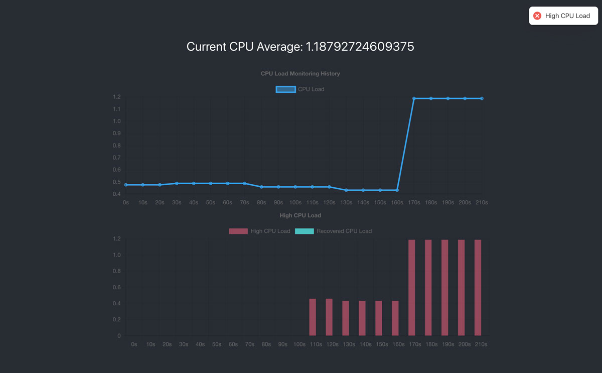

# Load Monitoring Web App

## Installation
- Install dependencies with `npm install` or `yarn`
- Run the server with `npm start`
- Install dependencies for the client
 - `cd client`
 - `npm install` or `yarn`
- Run the client locally with `npm start`
- View the app from `http://localhost:3002/`

## User Stories
- As a user, I should know what my computer's current average CPU load.
- As a user, I should be able to see how my average CPU load changed over 10 minutes.
- As a user, I should see the CPU load average update every 10 seconds.
- As a user, I should know if my computer has been under heavy CPU load for 2 minutes or more and how many times this has occurred.
- As a user, I should know when my computer has recovered from heavy CPU load and how many times this has occurred.

## Tech
- Backend is using [Node](https://nodejs.org/) and [Express](https://expressjs.com/)
- Frontend is using [React](https://reactjs.org/)
- [ChartJS](https://www.chartjs.org/) for the interactive charts
- [react-hot-toast](https://react-hot-toast.com/) for toast notifications

## Improvements
If I was deploying this application to production, I would want to make the following adjustments:

- Instead of storing the current CPU average within the backend endpoint, I would also store the history. 
- Currently the `fetchAndTrackData` function contains a few conditionals. If we're working with a lot of data, these conditionals would affect performance. This could be improved by breaking out some of these conditionals and adding them to separate functions (i.e. moving the logic for triggering the toast messages).
- To restructure this so it could scale better, instead of keeping track of the application state with hooks, I would utilize Redux.
